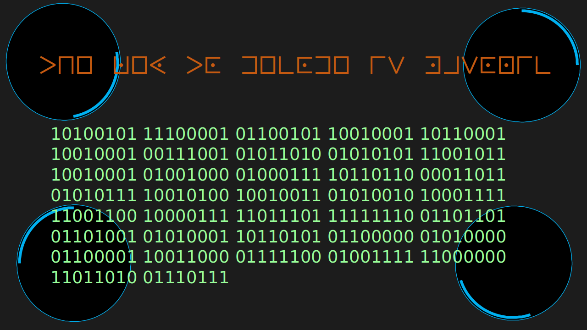

# [Prometheus](https://infernoctf.live/challenges#Prometheus)
Crypto,
200 Points

Author: alphachaos

Writeup by: **archerrival**

## Description
>We've stumbled across what looks like a crashed Alien Spaceship. We're sending you a screenshot of the Remote Crashed Craft Computer Console to see if you can decipher anything from it.



## Solution

The description mentions `Remote Crashed Craft Computer Console`, which corresponds to a rc4 encryption. This encryption requires a key
to use, so we turn back to the png file. The code at the top of the image looks similar to the [Masonic Cipher](https://sites.google.com/site/lostsymbolproject/masonic-cipher).


Decrypting the code, we get `the key to decode is masonic`. Using `masonic` as our key to decrypt the binary in the image, we receive our flag.

```infernoCTF{5tr34ms_0f_Z3r0s_4nd_0n35}```
