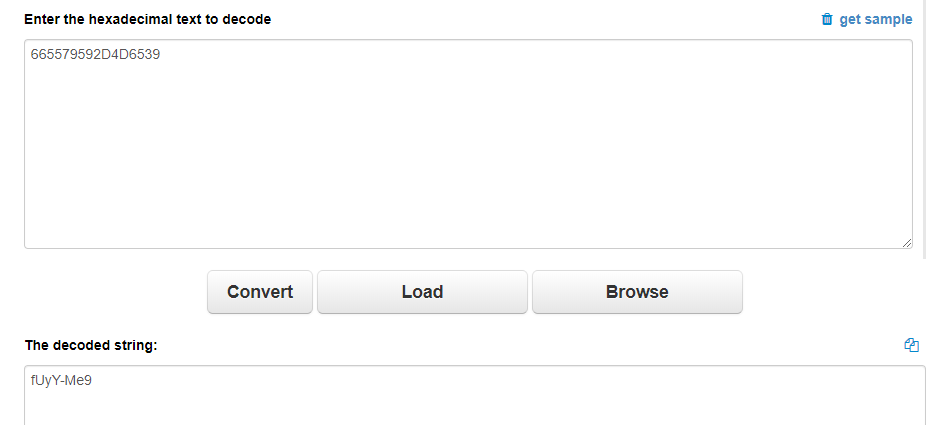

## [Web Crackme](https://infernoctf.live/challenges#Web%20Crackme)

Reversing, 399 Points

Author : MrT4ntr4

Writeup By: **-0x1c**

>Are you the guy who loves Web+RE!!<br/>
>Check this out then: http://104.197.168.32:17030/#challenge<br/>
PS: If you don't get any result after submitting the password, you might want to refresh the page.

## Solution:
Upon entering the website, we are greeted with a screen that looks like this.
 

We can attempt to guess a few random keys, but they will come back with the error message "Naah, Remember I'm the future!!"<br/>
 

If we open up our network tab inside of our web browser and refresh the page, we will see a few scripts being run.


From these, our main interests are "[assembly.wat](http://104.197.168.32:17030/challenge/assembly.wat)" and "[script.js](http://104.197.168.32:17030/challenge/script.js)" as they seem to not be something put there by default.

Our suspicions are further pushed in this direction as if we were to open "[script.js](http://104.197.168.32:17030/challenge/script.js)" we will be shown this code

```js
const wasmInstance = new WebAssembly.Instance(wasmModule, {});
const { myFunction1,myFunction2 } = wasmInstance.exports;

let res1 = myFunction1().toString(16);
let res2 = myFunction2().toString(16);

let finalres = res1 + res2;

if (finalres ==  stringFromKey){
	alert("Here you go infernoCTF{"+key+"}");
}
else{
	
	alert("Naah, Remember I'm the future!!");
	
}

```

We see a bit of our flag format here, but we sadly don't get a key for it. 
With the information on this site, we can infer that we need to somehow grab the key and have the key evaluate to the output of `myFunction1()` and `myFunction2()`'s returns, converted into a string from hex, then concatinated.

Now, lets go check out that [assembly.wat](http://104.197.168.32:17030/challenge/assembly.wat) file.

Opening the file yields us this

```wasm
(module


  (memory 1)


  (func $myFunction1 (result i32)

   (i32.store
      (i32.const 0)
      (i32.const 0xd359beef) 

    )

    (i32.store
      (i32.const 3)
      (i32.const 0x5579) 

    )
	
	(i32.store
	(i32.const 5)
	(i32.const 0x66) 

	)


    (i32.load
      (i32.const 2)
    )
  )
  
  
  (func $myFunction2 (result i32)
    (i32.store
      (i32.const 0)
      (i32.const 0xc939ba2d) 

    )

   (i32.store
      (i32.const 3)
      (i32.const 0x7165) 

    )
	
	(i32.store16
	(i32.const 4)
	(i32.const 0x2D4D) 

	)

    (i32.load
      (i32.const 2)
    )
  )
  
  

  (export "myFunction1" (func $myFunction1))
  (export "myFunction2" (func $myFunction2))

)
```

Web Assembly, also known as WASM, *Gross* (but quite cool, and indeed, *the future*).

Looking through the code, we can make sense of it. Our returning variable seems to be i32, as it is the only variable there,
and we have a statement that seems to `load` a variable off of it.

Web Assembly is in little endian, so when interpreting these pieces of hex, we must be aware that they will not be entered into the variable the way we might immediately expect due to the endienness.

Our hex value `0xd359beef` will become `0xefbe59d3` when loaded into the variable at the `0`th bit (which is what `(i32.const 0)` is saying to do)


With this information in mind, lets draw out what happens to this variable.


Now, lets go ahead and check out the next hex value `0x5579`, which will become `0x7955` due to endienness.

Let's now go ahead and put this value into the 3rd bit of the variable (overwriting the d3, as it was there previously, due to the `(i32.const 3)`)

Our variable should now look like this.


Now the final piece of the first variable should be very easy, as it is just one bit, meaning we don't have to mess with it for endenness, and just have to place it directly into the 5th section.

Combining all the pieces together, this yields us with `0xefbe59795566`


Now, let's do that all again for the other variable :) (yes, the arrows were supposed to point down...)


This yields us `0x2dba39654D2D`

Now that we have the variables, we can see that in the code, the variables are only being loaded and returned starting at the 2nd bit position due to the code `i32.load 2`

Going back to the first variable, `0xefbe59795566`, we grab all the pieces starting at the 2nd bit until the end, then due to endienness, reversing its order back once again, after grabbing only the piece we need.

This will give us `66557959` for the first variable


and `2D4D6539` for the second variable


Now let's just concatinate them together into `665579592D4D6539` and throw them into an Hex to String converter to get our key!



Our key is `fUyY-Me9`.

Throwing this key into the original website yields the result of 


And with that, we have our flag!

Flag: `infernoCTF{fUyY-Me9}`

