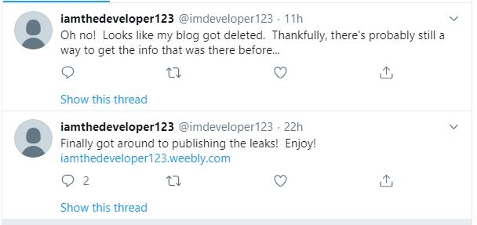

# [Whistle Blower](https://infernoctf.live/challenges#Whistle%20Blower)
OSINT,
300 Points

Author: nullpxl

Writeup by: **archerrival**

## Description
>After playing some 2048 you come across an interesting email exchange... What could it lead to?

```
X-Gmail-Labels: Sent,Opened,leak
MIME-Version: 1.0
Date: Tue, 24 Dec 2019 13:59:13 -0800
Subject: Re: Status Regarding Your Employment
From: iam thedeveloper <imdeveloper123@gmail.com>
To: angry employer <veryangryemployer@gmail.com>
Content-Type: multipart/alternative; boundary="0000000000005405a8059a7a4108"

--0000000000005405a8059a7a4108
Content-Type: text/plain; charset="UTF-8"

Hello Angry Employer,

I will not stand for this, it was a simple mistake that anyone could have
made.
If anything, I should blame your company training!
I'm leaking all confidential information, on purpose this time.

Hope you like being the center of attention on infosec twitter!

- imdeveloper123

On Tue, Dec 24, 2019 at 1:54 PM angry employer <veryangryemployer@gmail.com>
wrote:

> Hello Mr. imdeveloper123,
>
> Are you kidding me? You leaked company info by making the dot-files you
> use for work purposes *public* on your GitHub?
> It should come at no surprise that as of the time of writing this email,
> you are permanently released from your current job.
>
> Please talk to HR ASAP.
>
> - Angry Employer
>

--0000000000005405a8059a7a4108
Content-Type: text/html; charset="UTF-8"
Content-Transfer-Encoding: quoted-printable

<div dir=3D"ltr"><div>Hello Angry Employer,</div><div><br></div><div>I will=
 not stand for this, it was a simple mistake that anyone could have made.=
=C2=A0 <br></div><div>If anything, I should blame your company training!=C2=
=A0 <br></div><div>I&#39;m leaking all confidential information, on purpose=
 this time.</div><div><br></div><div>Hope you like being the center of atte=
ntion on infosec twitter!</div><div><br></div><div>- imdeveloper123<br>=
</div></div><br><div class=3D"gmail_quote"><div dir=3D"ltr" class=3D"gmail_=
attr">On Tue, Dec 24, 2019 at 1:54 PM angry employer &lt;<a href=3D"mailto:=
veryangryemployer@gmail.com">veryangryemployer@gmail.com</a>&gt; wrote:<br>=
</div><blockquote class=3D"gmail_quote" style=3D"margin:0px 0px 0px 0.8ex;b=
order-left:1px solid rgb(204,204,204);padding-left:1ex"><div dir=3D"ltr"><d=
iv>Hello Mr. imdeveloper123,</div><div><br></div><div>Are you kidding me? You le=
aked company info by making the dot-files you use for work purposes *public=
* on your GitHub?=C2=A0 <br></div><div>It should come at no surprise that a=
s of the time of writing this email, you are permanently released from your=
 current job.=C2=A0 <br></div><div><br></div><div>Please talk to HR ASAP.</=
div><div><br></div><div>- Angry Employer<br></div></div>
</blockquote></div>

--0000000000005405a8059a7a4108--

MIME-Version: 1.0
From: angry employer <veryangryemployer@gmail.com>
Date: Tue, 24 Dec 2019 13:54:14 -0800
Subject: Status Regarding Your Employment
To: imdeveloper123@gmail.com
Content-Type: multipart/alternative; boundary="00000000000020ca41059a7a30ce"

--00000000000020ca41059a7a30ce
Content-Type: text/plain; charset="UTF-8"

Hello Mr. imdeveloper123,

Are you kidding me? You leaked company info by making the dot-files you use
for work purposes *public* on your GitHub?
It should come at no surprise that as of the time of writing this email,
you are permanently released from your current job.

Please talk to HR ASAP.

- Angry Employer

--00000000000020ca41059a7a30ce
Content-Type: text/html; charset="UTF-8"
Content-Transfer-Encoding: quoted-printable

<div dir=3D"ltr"><div>Hello Mr. imdeveloper123,</div><div><br></div><div>Are you=
 kidding me? You leaked company info by making the dot-files you use for wo=
rk purposes *public* on your GitHub?=C2=A0 <br></div><div>It should come at=
 no surprise that as of the time of writing this email, you are permanently=
 released from your current job.=C2=A0 <br></div><div><br></div><div>Please=
 talk to HR ASAP.</div><div><br></div><div>- Angry Employer<br></div></div>

--00000000000020ca41059a7a30ce--

```

## Solution
We were able to open the file given with Notepad++. Since this was an OSINT challenge, I looked for things that could be found online
in public webpages.

```Hope you like being the center of attention on infosec twitter!```

This line hints to look at the twitter page of **imdeveloper123**. Going to https://twitter.com/imdeveloper123, we find that he has
made two tweets.



The first tweet hints that we should use Wayback Machine to find an old archived version of his deleted blog. Using the Wayback Machine
on the https://iamthedeveloper123.weebly.com/ gives us one snapshot on December 24th. Opening the website gives us the flag.

`infernoCTF{y0u_f0und_7h3_d1sgrun7l3d_empl0y33!}`
